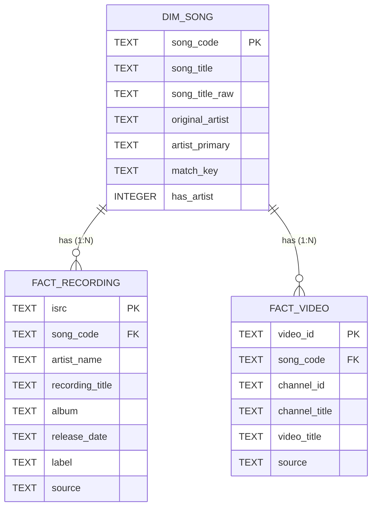
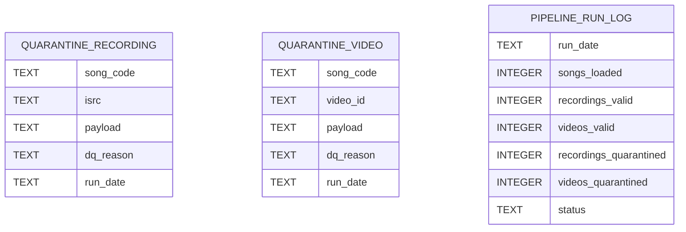

# Entity Relationship Diagram (ERD)

The model follows the study-case definition: a **Song** (composition) has many
**Recordings** (each uniquely identified by an **ISRC**), and many **Videos** on
YouTube. Both are one-to-many from the song.

## Supporting (operational) tables

## Marts (views) on top of the model

| View | Answers | Grain |
|------|---------|-------|
| `mart_song_isrc_count`  | ISRCs per song (Spotify)  | one row per song |
| `mart_song_video_count` | Videos per song (YouTube) | one row per song |
| `mart_song_overview`    | both, side by side        | one row per song |

### Why this shape
- **`song_code` is the join key**, never the title. The catalogue contains the same
  title for different compositions (e.g. *AMPUNI AKU* appears under codes `4580` and
  `3459`; *DOA*, *BUNGA*, *SELAMAT TINGGAL*, *HUJAN* repeat too). Deduplicating on
  title would wrongly merge distinct songs.
- **ISRC and video_id are natural primary keys** — they guarantee idempotent upserts
  and make "count distinct" trivially correct.
- A star schema (one dimension, two fact tables) keeps the two business aggregations
  as simple, index-friendly `GROUP BY song_code` queries that port directly to a
  columnar warehouse.
